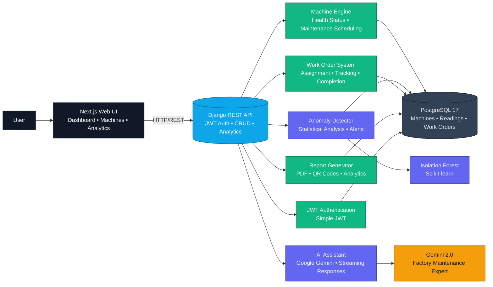

<h2 align="center">⚙️ IndustriSense: Smart Factory Maintenance Tracker</h2>

<h3 align="center">Predictive Maintenance Platform for Industrial Operations</h3>

<p align="center"><b>IndustriSense</b> transforms factory maintenance from reactive firefighting into proactive optimization through real-time monitoring, intelligent anomaly detection, and predictive analytics. Built for modern manufacturing, it provides complete machine health tracking, automated work order management, and maintenance recommendations.</p>

<p align="center"><em>Production-Ready Factory Maintenance Solution</em></p><br>

<div align="center"> 
  
  [](https://djangoproject.com)
  [](https://nextjs.org)
  [](https://reactjs.org)
  [](https://typescriptlang.org)
  [](https://postgresql.org)
  [](https://python.org)
  
  [](http://makeapullrequest.com)
  
</div>
<br>

<div align="center">

> Predict breakdowns, prevent losses with intelligent maintenance management

</div>
<br>

#### Demo Video : https://drive.google.com/file/d/11cAwKQq0BJCXkgqSEfep5lcqPZwqylbs/view?usp=sharing

<br>

## Table of Contents

- [🎯 Features](#features)
- [🏗️ Architecture](#architecture)
- [⚡ Quick Start](#quick-start)
  - [Backend Setup](#backend-setup)
  - [Frontend Setup](#frontend-setup)
- [⚙️ Configuration](#configuration)
- [💻 Usage](#usage)
  - [Dashboard](#dashboard)
  - [Machine Management](#machine-management)
  - [Work Orders](#work-orders)
  - [AI Assistant](#ai-assistant)
- [🧠 Technical Innovation](#technical-innovation)
  - [Anomaly Detection](#anomaly-detection)
  - [Predictive Analytics](#predictive-analytics)
  - [AI Chatbot](#ai-chatbot)
- [📄 License](#license)

## Features

- **Real-Time Monitoring**: Live machine health tracking with temperature, vibration, and pressure sensors
- **Anomaly Detection**: Statistical analysis using Isolation Forest algorithms for early failure detection
- **Predictive Maintenance**: ML-powered health scoring predicts maintenance needs before breakdowns
- **Work Order Management**: Complete lifecycle tracking from creation to completion with cost analysis
- **QR Code Integration**: Quick machine identification and reading logging via QR scanning
- **Spare Parts Inventory**: Automated low-stock alerts and restock management
- **AI Assistant**: Google Gemini-powered chatbot for maintenance troubleshooting and guidance
- **Analytics Dashboard**: Comprehensive insights with charts, trends, and performance metrics
- **PDF Reports**: Automated maintenance reports with reading history and cost analysis
- **Role-Based Access**: Admin, Supervisor, and Technician roles with appropriate permissions
- **Mobile Responsive**: Full functionality across desktop, tablet, and mobile devices

## Architecture



This project demonstrates integration between:
- **Django REST Framework** for robust backend API with authentication and permissions
- **Next.js 16** with React 19 for modern, performant frontend with server-side rendering
- **PostgreSQL** for reliable relational data storage with complex queries
- **Scikit-learn** for machine learning-powered anomaly detection and health scoring
- **Google Gemini AI** for intelligent maintenance assistance and troubleshooting
- **ReportLab** for automated PDF report generation with charts and tables

## Quick Start

### Prerequisites

- Python 3.11+
- PostgreSQL 17+
- Node.js 18+
- npm or pnpm
- Docker

### Docker Setup (Recommended)

1. Clone the repository:
   ```bash
   git clone https://github.com/Vaibhavi45/IndustrySense-Master.git
   cd IndustrySense-Master
   ```

2. Configure environment:
   ```bash
   cp .env.docker .env
   ```

3. Start all services:
   ```bash
   docker-compose up -d
   ```

4. Access the application:
   - Frontend: http://localhost:3000
   - Backend API: http://localhost:8000/api
   - Database: localhost:5432

5. Stop services:
   ```bash
   docker-compose down
   ```

### Manual Setup

### Backend Setup

1. Clone the repository:
   ```bash
   git clone https://github.com/Vaibhavi45/IndustrySense-Master.git
   cd IndustrySense-Master
  
   ```

2. Install Python dependencies:
   ```bash
   pip install -r requirements.txt
   ```

3. Configure database in `.env`:
   ```bash
   DB_NAME=factory_maintenance_db
   DB_USER=postgres
   DB_PASSWORD=postgres
   DB_HOST=localhost
   DB_PORT=5432
   SECRET_KEY=your-secret-key
   ```

4. Run migrations:
   ```bash
   python manage.py migrate
   ```

5. Load sample data:
   ```bash
   python load_sample_data.py
   ```

6. Start the API server:
   ```bash
   python manage.py runserver
   ```

API will be available at: http://localhost:8000/api

### Frontend Setup

1. Navigate to frontend directory:
   ```bash
   cd ../frontend
   ```

2. Install dependencies:
   ```bash
   npm install
   ```

3. Configure API endpoint in `.env.local`:
   ```bash
   NEXT_PUBLIC_API_URL=http://localhost:8000/api
   NEXT_PUBLIC_GEMINI_API_KEY=your-gemini-api-key
   ```

4. Start development server:
   ```bash
   npm run dev
   ```

Frontend will be available at: http://localhost:3000

### Test Credentials

```
Admin:
  Username: admin
  Password: HueHueHue#69

Supervisor:
  Username: supervisor
  Password: pass

Technician:
  Username: tech
  Password: pass
```

## Configuration

### Backend Environment Variables

| Variable | Description | Default |
|----------|-------------|---------|
| DB_NAME | Database name | factory_maintenance_db |
| DB_USER | Database username | postgres |
| DB_PASSWORD | Database password | postgres |
| DB_HOST | Database hostname | localhost |
| DB_PORT | Database port | 5432 |
| SECRET_KEY | Django secret key | (required) |
| DEBUG | Debug mode | True |
| ALLOWED_HOSTS | Allowed hosts | localhost,127.0.0.1 |
| CORS_ALLOWED_ORIGINS | CORS origins | http://localhost:3000 |

### Frontend Environment Variables

| Variable | Description | Default |
|----------|-------------|---------|
| NEXT_PUBLIC_API_URL | Backend API URL | http://localhost:8000/api |
| NEXT_PUBLIC_GEMINI_API_KEY | Google Gemini API key | (required) |

## Usage

### Dashboard

The main dashboard provides:
- **Machine Overview**: Real-time health status of all machines with color-coded indicators
- **Health Distribution**: Visual breakdown of machines by health status (Green/Yellow/Red/Critical)
- **Work Order Summary**: Pending, in-progress, and completed work orders
- **Recent Alerts**: Latest anomalies and maintenance notifications
- **Quick Actions**: Fast access to log readings, create work orders, and view analytics

### Machine Management

**List Machines**: View all machines with search, filter, and sort capabilities
```
GET /api/machines/
```

**Machine Details**: Complete machine information with 4 tabs:
- **Overview**: Basic info, health status, maintenance schedule
- **Readings**: Historical sensor data with anomaly highlighting
- **Work Orders**: Associated maintenance tasks and history
- **Analytics**: Health score trends and predictive insights

**Add Machine**: Register new equipment with:
- Machine ID, name, type, location
- Installation date, warranty information
- Maintenance frequency and schedule
- Specifications and documentation

**QR Code Generation**: Automatic QR code creation for quick machine identification

### Work Orders

**Create Work Order**:
- Select machine and assign technician
- Set priority (Low/Medium/High/Critical)
- Schedule maintenance date
- Add description and requirements

**Track Progress**:
- Start work order (changes machine status to "Under Maintenance")
- Log parts used and labor hours
- Add completion notes and costs
- Complete work order (updates machine maintenance date)

**Cost Analysis**: Automatic calculation of labor costs, parts costs, and total expenses

### AI Assistant

The AI chatbot provides:
- **Equipment Troubleshooting**: Diagnose issues based on symptoms
- **Maintenance Guidance**: Step-by-step repair instructions
- **Error Code Lookup**: Explain error codes and solutions
- **Best Practices**: Maintenance tips and preventive measures
- **Parts Information**: Identify required spare parts

Access via the floating chat button in the bottom-right corner.

## Technical Innovation

### Anomaly Detection

**Core Algorithm**: Statistical analysis using Isolation Forest with 2-sigma threshold

1. **Data Collection**: Temperature, vibration, oil pressure readings
2. **Historical Analysis**: Compare against 30-day rolling average
3. **Statistical Validation**: Z-score calculation with 2-sigma threshold
4. **Anomaly Classification**: Automatic flagging of outliers
5. **Alert Generation**: Real-time notifications for critical anomalies

**Implementation**:
```python
# backend/machines/utils.py
def detect_anomaly(machine, new_reading):
    recent_readings = machine.readings.filter(
        timestamp__gte=timezone.now() - timedelta(days=30),
        is_anomaly=False
    ).order_by('-timestamp')[:50]
    
    # Calculate mean and std for each metric
    # Apply 2-sigma threshold
    # Return anomaly status and reason
```

### Predictive Analytics

**Health Score Algorithm**: ML-powered prediction using Isolation Forest

1. **Feature Engineering**: Extract temperature, vibration, pressure patterns
2. **Model Training**: Isolation Forest with 10% contamination rate
3. **Score Calculation**: Normalize decision function to 0-100 scale
4. **Trend Analysis**: Compare first half vs second half of data
5. **Prediction**: Estimate days until maintenance needed

**Health Status Classification**:
- **Critical** (<60): Immediate maintenance required (3 days)
- **Warning** (60-80): Schedule maintenance soon (7 days)
- **Healthy** (>80): Normal operation (30 days)

### AI Chatbot

**Technology**: Google Gemini 2.0 Flash with streaming responses

**System Instructions**:
```
You are an expert factory maintenance assistant specializing in:
- Industrial equipment troubleshooting
- Preventive maintenance procedures
- Error code diagnostics
- Spare parts identification
- Safety protocols
```

**Features**:
- Real-time streaming responses
- Context-aware conversations
- Factory-specific knowledge base
- No markdown formatting (plain text)

## Documentation

**📖 [API Documentation](API_DOCUMENTATION.md)** - Complete REST API reference with all endpoints, request/response examples, and authentication details

## License

This project is licensed under the MIT License - see the [LICENSE](LICENSE) file for details.

---

<div align="center">
  <small><em>IndustriSense: Predict breakdowns, prevent losses.</em> ⚙️</small>
</div>
